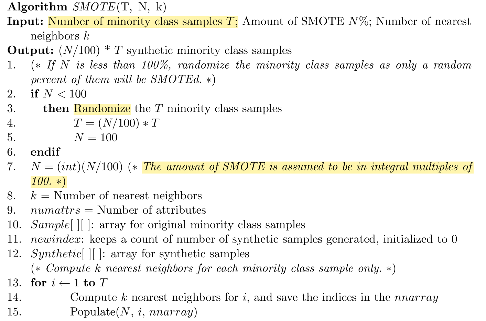
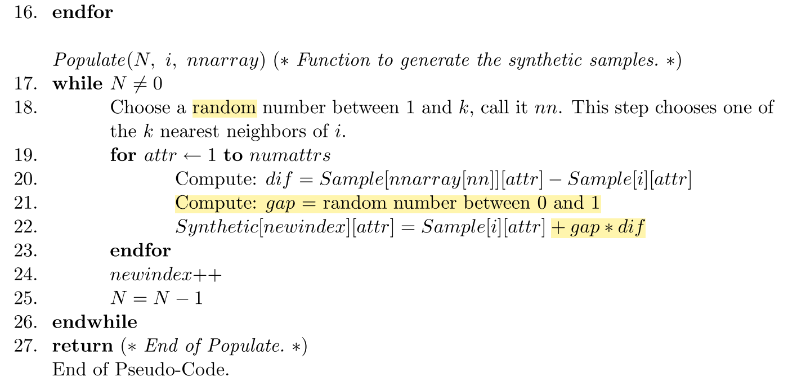

# SMOTE: Synthetic Minority Over-sampling Technique
**Published Year**: 2002  
**Author**: Chawla, Nitesh V Bowyer, Kevin W Hall, Lawrence O Kegelmeyer, W Philip

## Key points

- Under-sampling of the majority (normal)class has been proposed as a good means of increasing the sensitivity of a classifier to the minority class.

- combination of our method of over-sampling the minority (abnormal)class and under-sampling the majority (normal) class can achieve better classifier performance (in ROC space) than only under-sampling the majority class.

- SMOTE forces focused learning and introduces a bias towards the minority class.

- SMOTE builds larger decision regions that contain nearby minority class points.

## Why SMOTE is better than over sampling

minority over-sampling is done by `replication` (sampling with replacement)versus the introduction of synthetic examples. With replication, the decision region that results in a classification decision for the minority class can actually `become smaller and more specific` as the minority samples in the region are replicated.

## Pseudocode

Randomization is used three times.  
1. randomize minority class samples   
2. randomly select one of neighbours  
3. randomly choose the gap in line 22

