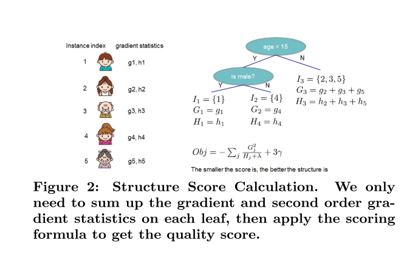
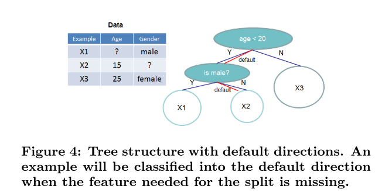

# XGBoost: A Scalable Tree Boosting System
Published Year: 2016  
Author: Chen Tianqi

 **TREE BOOSTING IN A NUTSHELL**

minimize the following regularized objective

$\mathcal{L}(\phi)=\sum_{i} l\left(\hat{y}_{i}, y_{i}\right)+\sum_{k} \Omega\left(f_{k}\right)$

where $\Omega(f)=\gamma T+\frac{1}{2} \lambda\|w\|^{2}$  
T: the number of leaves  
w: leaf weights  
Ω penalizes the complexity of the model  
- a continuous score on each of the leaf, we use wi to represent score on i-th leaf.
- the regularized objective will tend to select a model employing simple and predictive functions.

**Shrinkage**
- Shrinkage scales newly added weights by a factor η after each step of tree boosting.

- Similar to a learning rate in tochastic optimization, shrinkage reduces the influence of each individual tree and leaves space for future trees to improve the model.

**Column Subsampling**
- column sub-samples also speeds up computations of the parallel algorithm described later.

- subsampling columns not only reduces running time, and but also gives a bit higher performance for this problem. This could due to the fact that the subsampling helps prevent overfitting, which is observed by many of the users.

**Gradient Tree Boosting**
$\mathcal{L}^{(t)}=\sum_{i=1}^{n} l\left(y_{i}, \hat{y}_{i}^{(t-1)}+f_{t}\left(\mathbf{x}_{i}\right)\right)+\Omega\left(f_{t}\right)$
$\mathcal{L}^{(t)} \simeq \sum_{i=1}^{n}\left[l\left(y_{i}, \hat{y}^{(t-1)}\right)+g_{i} f_{t}\left(\mathbf{x}_{i}\right)+\frac{1}{2} h_{i} f_{t}^{2}\left(\mathbf{x}_{i}\right)\right]+\Omega\left(f_{t}\right)$
Second-order approximation can be used to quickly optimize the objective in the general setting.

should know more about: taylor expansion
- https://en.wikipedia.org/wiki/Taylor_series
- https://en.wikipedia.org/wiki/Taylor's_theorem

$\tilde{\mathcal{L}}^{(t)}(q)=-\frac{1}{2} \sum_{j=1}^{T} \frac{\left(\sum_{i \in I_{j}} g_{i}\right)^{2}}{\sum_{i \in I_{j}} h_{i}+\lambda}+\gamma T$
The formular can be used as a scoring function to measure the quality of a tree structure q. This score is like the impurity score for evaluating decision trees, except that it is derived for a wider range of objective functions.

$\mathcal{L}_{s p l i t}=\frac{1}{2}\left[\frac{\left(\sum_{i \in I_{L}} g_{i}\right)^{2}}{\sum_{i \in I_{L}} h_{i}+\lambda}+\frac{\left(\sum_{i \in I_{R}} g_{i}\right)^{2}}{\sum_{i \in I_{R}} h_{i}+\lambda}-\frac{\left(\sum_{i \in I} g_{i}\right)^{2}}{\sum_{i \in I} h_{i}+\lambda}\right]-\gamma$

This formula is usually used in practice for evaluating the split candidates.

**Find split points**

The local proposal refines the candidates after splits, and can potentially be more appropriate for deeper trees. We find that the local proposal indeed requires fewer candidates. The global proposal can be as accurate as the local one given enough candidates.

**Approximate Algorithm**

To summarize, the algorithm first proposes candidate splitting points according to percentiles of feature distribution (a specific criteria will be given in Sec. 3.3). The algorithm then maps the continuous features into buck- ets split by these candidate points, aggregates the statistics and finds the best solution among proposals based on the aggregated statistics.

**Handle missing values**
